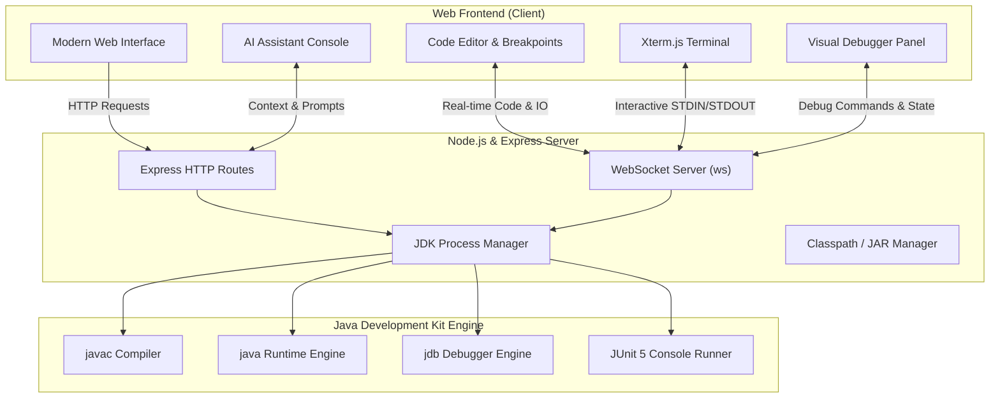

<div align="center">

# 🚀 WebJavaIDE

### A Modern, Feature-Rich Browser-Based Java Development Environment

[](https://opensource.org/licenses/ISC)
[](https://nodejs.org/)
[](https://adoptium.net/)
[](https://expressjs.com/)
[](https://github.com/websockets/ws)
[](https://junit.org/junit5/)

An intuitive, lightweight, and powerful Web-based Java IDE that turns your browser into a full-fledged Java workspace. Built with high-performance real-time execution, interactive terminal capabilities, visual step debugging, automated unit testing, and integrated AI intelligence.

[Explore Features](#-key-features) · [Quick Start](#-quick-start) · [Architecture](#-system-architecture) · [Report Bug](https://github.com/vaibhav780/WebJavaIde/issues) · [Request Feature](https://github.com/vaibhav780/WebJavaIde/issues)

---

</div>

## 📋 Table of Contents

- [About The Project](#-about-the-project)
- [Key Features](#-key-features)
- [System Architecture](#-system-architecture)
- [Prerequisites](#-prerequisites)
- [Quick Start](#-quick-start)
  - [Installation](#1-installation)
  - [Environment Setup](#2-environment-setup)
  - [Running the Application](#3-running-the-application)
- [Core Features Guide](#-core-features-guide)
  - [Interactive Terminal](#-interactive-terminal-xtermjs)
  - [Visual JDB Debugger](#-visual-jdb-debugger)
  - [JUnit 5 Test Execution](#-junit-5-test-runner)
  - [AI Code Assistant](#-ai-code-assistant)
- [Project Structure](#-project-structure)
- [Configuration](#-configuration)
- [Contributing](#-contributing)
- [License](#-license)

---

## 💡 About The Project

**WebJavaIDE** bridges the gap between lightweight web editors and heavyweight desktop IDEs. It provides developers, students, and educators with a zero-install-on-client Java workspace directly in any web browser.

Powered by a Node.js & Express backend integrated with native Java Development Kit (JDK) process management, WebJavaIDE compiles and executes Java applications safely on the host while delivering real-time I/O over WebSockets.

---

## ✨ Key Features

### ⚡ Live Compilation & Execution
- **Sub-Second Compilation**: Near-instant feedback powered by streaming standard process channels.
- **Multi-File Workspace**: Supports multi-class projects, custom packages, and modular code structures.

### 💻 Interactive Terminal (`Xterm.js`)
- Full interactive console powered by **Xterm.js**.
- Supports real-time input handling (`Scanner`, `System.in`, `BufferedReader`).
- Rich ANSI color codes and standard terminal controls.

### 🐞 Visual Step Debugger (`jdb`)
- Graphical UI wrapper around Java's native Command Line Debugger (`jdb`).
- **Breakpoints**: Toggle line breakpoints directly in the editor margin.
- **Execution Control**: Step Over, Step Into, Step Out, and Resume execution.
- **Variable Inspection**: Real-time stack frame and local variable inspection.

### 🧪 JUnit 5 Test Runner
- Integrated test suite execution via embedded `junit-platform-console-standalone`.
- Auto-detects test methods, test classes, and displays detailed test pass/fail results.

### 🤖 AI-Powered Coding Assistant
- **Automated Error Diagnostics**: Real-time explanation of compilation errors and stack traces.
- **Smart Quick Fixes**: One-click code resolution and refactoring suggestions.
- **Test Generation**: Automatically generate JUnit 5 test cases for your functions.
- **Code Explanation**: Deep structural walkthroughs for complex algorithms.

### 📦 Workspace & Library Management
- **JAR Manager**: Easily attach external `.jar` library dependencies.
- **Zip Export**: Download your complete project workspace as a ready-to-run `.zip` archive.

---

## 🏗 System Architecture



---

## ⚙️ Prerequisites

Ensure your host environment meets the following requirements:

1. **Node.js** (v16.0 or higher)
   - Verify: `node -v`
   - Download: [Node.js Official Site](https://nodejs.org/)

2. **Java Development Kit (JDK 11+)**
   - Verify: `javac -version` and `java -version`
   - Download: [Eclipse Adoptium OpenJDK](https://adoptium.net/)
   - Ensure `javac` and `java` binaries are in your system's `PATH` environment variable.

---

## 🚀 Quick Start

### 1. Installation

Clone the repository to your local machine:

```bash
git clone https://github.com/vaibhav780/WebJavaIde.git
cd WebJavaIde
```

### 2. Environment Setup

Run the automatic one-time setup script suitable for your system:

#### Windows (Command Prompt)
```cmd
setup.bat
```

#### Windows (PowerShell)
```powershell
.\setup.ps1
```

#### macOS / Linux / Cross-Platform (NPM)
```bash
npm run setup
```

The setup script verifies Node.js and JDK installations and installs required Node modules (`express`, `ws`, `adm-zip`, `xml2js`).

### 3. Running the Application

Start the local server:

```bash
npm start
```

Open your web browser and navigate to:
👉 **[http://localhost:5000](http://localhost:5000)**

---

## 📖 Core Features Guide

### 💻 Interactive Terminal (Xterm.js)
The embedded terminal allows seamless interaction with programs requiring user input:
- Type input directly into the terminal prompt when your program calls `Scanner scanner = new Scanner(System.in)`.
- Enjoy full terminal features such as history navigation and text selection.

### 🐞 Visual JDB Debugger
1. Open a Java source file.
2. Click the gutter next to any code line to set a breakpoint.
3. Click **Debug**. The application launches `jdb` in the background and pauses execution at your breakpoint.
4. Use the debugger toolbar to step through lines and inspect active variable values in real time.

### 🧪 JUnit 5 Test Runner
1. Write or load JUnit 5 test classes (e.g., using `@Test`, `@BeforeEach`, `@DisplayName`).
2. Click **Run Tests**.
3. View structured pass/fail results, assertions failures, and execution times directly in the UI.

### 🤖 AI Code Assistant
- Click **Explain Code** to get a line-by-line breakdown of selected functions.
- Click **Fix Errors** when compilation fails to receive automatic fixes and explanations.
- Click **Generate Unit Tests** to create ready-to-run JUnit 5 suites for your current class.

---

## 📂 Project Structure

```text
WebJavaIde/
├── server.js               # Main Express HTTP server & WebSocket process orchestrator
├── server1.js              # Alternative / minimal server configuration
├── public/                 # Web client UI frontend
│   └── index.html          # Main Web IDE layout, components, and client-side logic
├── lib/                    # Included dependencies & JAR libraries
│   └── junit-platform-console-standalone-1.10.2.jar
├── temp_workspace/         # Sandbox compilation directory for workspace execution
├── setup.bat               # One-time setup script for Windows CMD
├── setup.ps1               # One-time setup script for Windows PowerShell
├── package.json            # Node.js project manifest and scripts
├── package-lock.json       # Locked dependency tree
└── README.md               # Project documentation
```

---

## 🔧 Environment Configuration

You can customize runtime settings using environment variables:

| Variable | Description | Default Value | Example |
| :--- | :--- | :--- | :--- |
| `PORT` | HTTP server port | `5000` | `PORT=8080 npm start` |
| `JAVA_HOME` | Path to JDK installation | System default | `JAVA_HOME=/usr/lib/jvm/java-17-openjdk` |

### Setting PORT on Windows PowerShell:
```powershell
$env:PORT=8080; npm start
```

### Setting PORT on Linux / macOS / CMD:
```bash
PORT=8080 npm start
```

---

## 🤝 Contributing

Contributions are welcome! If you'd like to improve WebJavaIDE:

1. **Fork the Repository**
2. **Create a Feature Branch** (`git checkout -b feature/AmazingFeature`)
3. **Commit your Changes** (`git commit -m 'Add some AmazingFeature'`)
4. **Push to the Branch** (`git push origin feature/AmazingFeature`)
5. **Open a Pull Request**)

Please report bugs or request features via [GitHub Issues](https://github.com/vaibhav780/WebJavaIde/issues).

---

## 📜 License

Distributed under the **ISC License**. See `package.json` for details.

---

<div align="center">

Made with ❤️ by [vaibhav780](https://github.com/vaibhav780)

</div>
